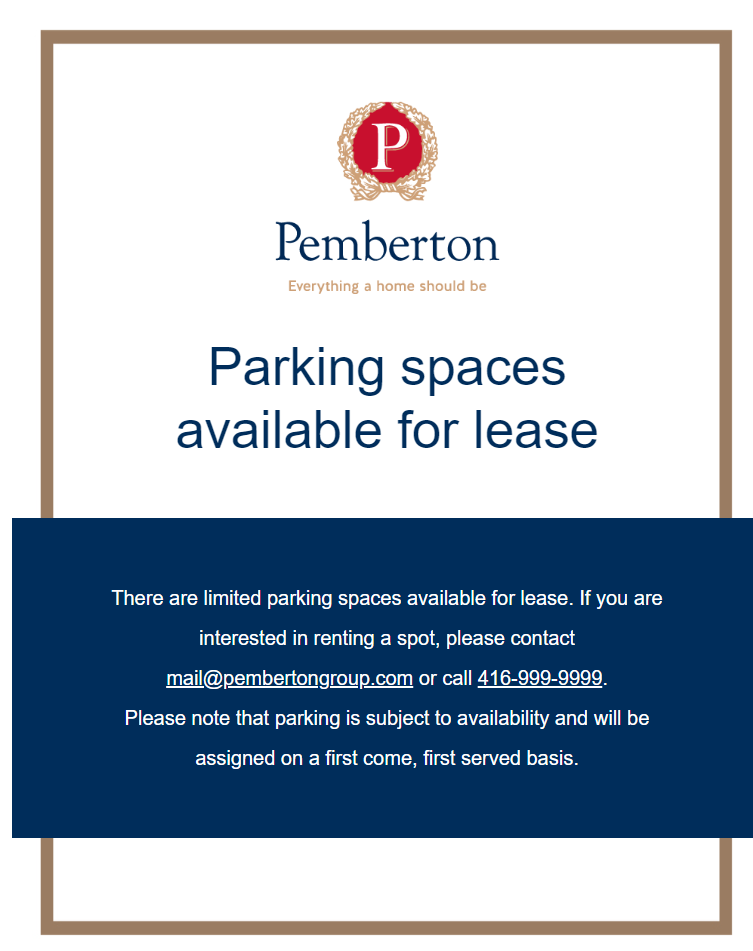

# Email Developer Projects

This repository contains 3 professionally developed email templates leveraging various technologies and best practices. 

1. Personalized Experience with AMPScript.

The image below demonstrates personalized email content tailored to individual preferences and behaviors.

This demonstrates the implementation of AMPScript in the email template.

2. Responsive and Table-based HTML Email Layouts:

